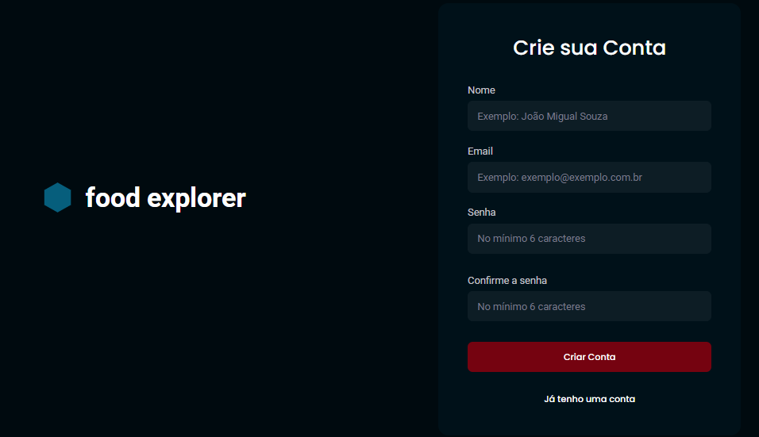
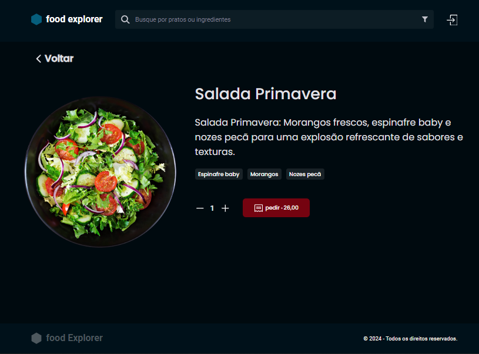
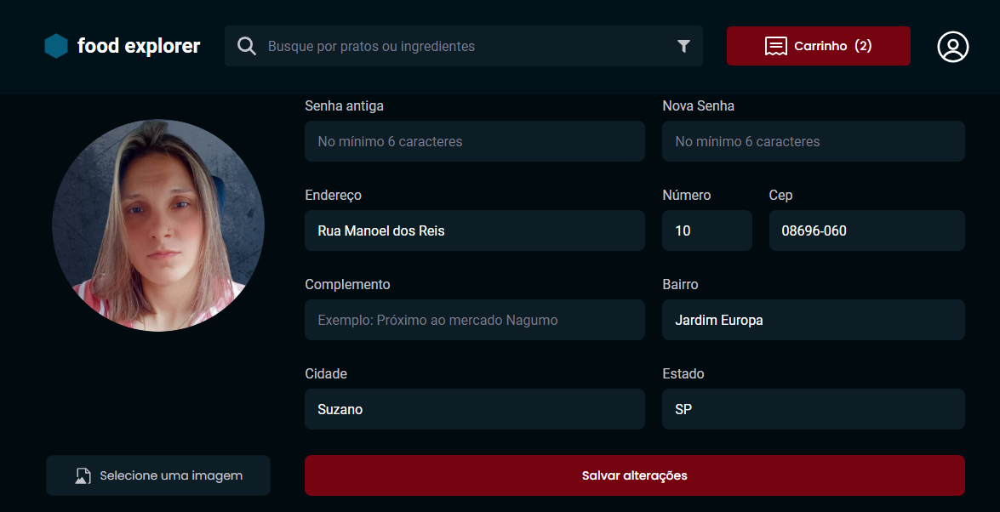
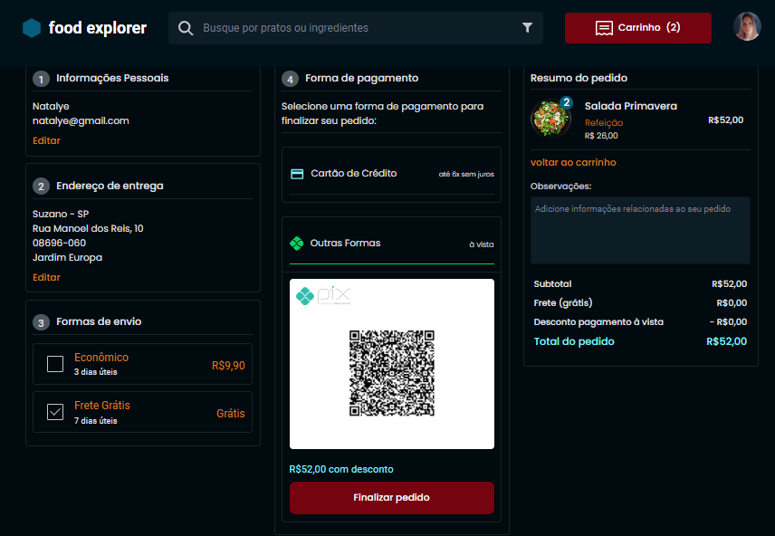
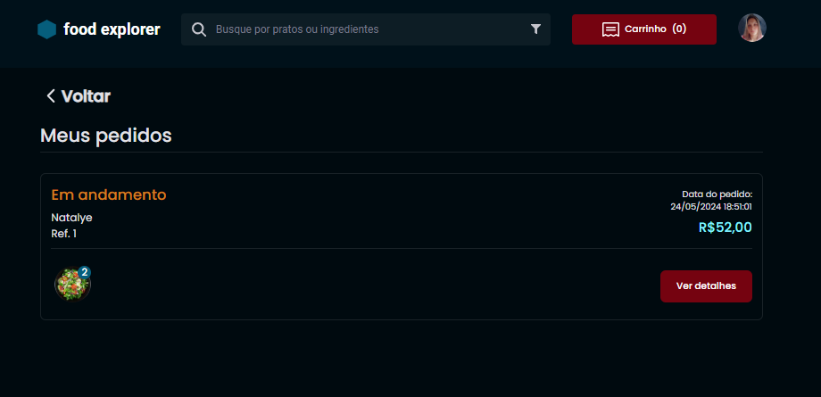
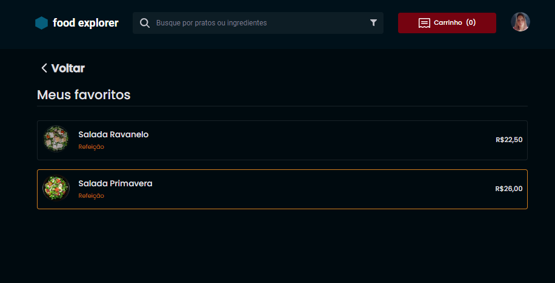
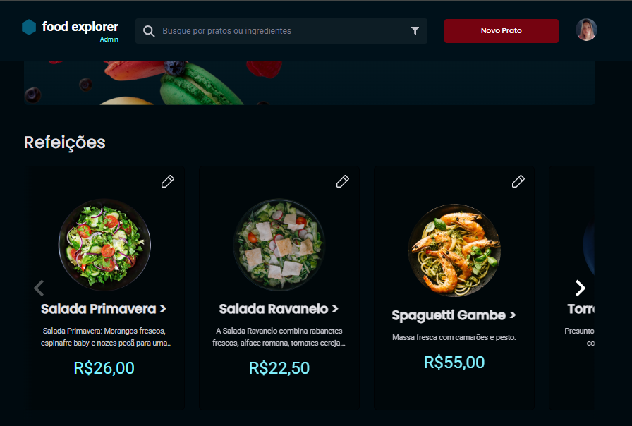
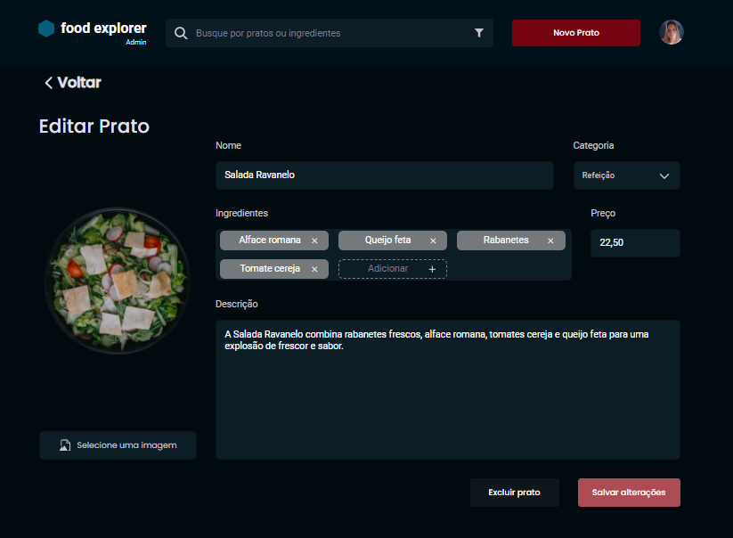
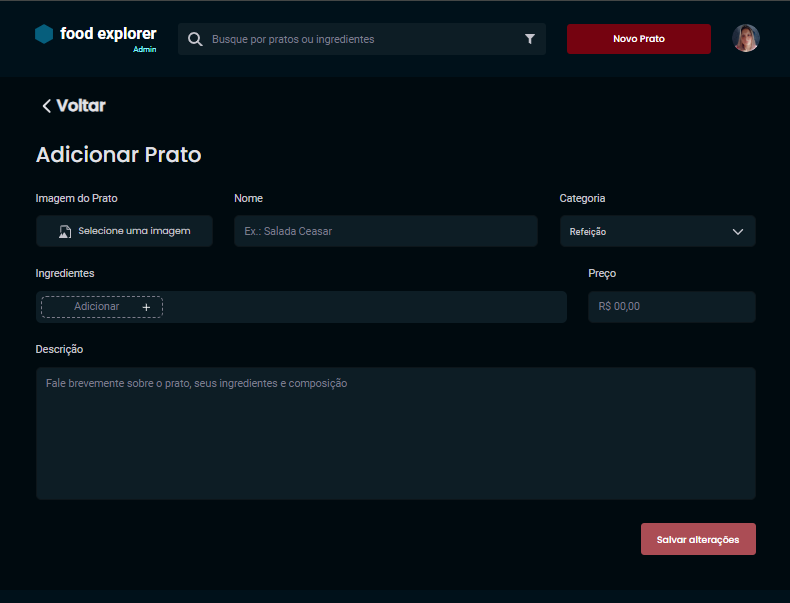

# Projeto Final Explorer

.png)

Dentro deste repositório reside o código-fonte do projeto de front-end, resultado do desafio final proposto no curso da Rocketseat. O projeto Food-explorer apresenta uma aplicação destinada a um estabelecimento gastronômico, oferecendo aos clientes um menu completo dos pratos disponíveis, facilitando a finalização das compras ao adicionar itens ao carrinho. Além disso, incluímos uma interface administrativa para gerenciamento dos pedidos, permitindo aos administradores acompanhar e atualizar o status das compras, além de analisar os produtos mais populares, entre outras funcionalidades exclusivas implementadas nesta versão. Com um layout intuitivo e responsivo, o Food-explorer busca proporcionar uma experiência agradável ao usuário, adaptando-se perfeitamente tanto a dispositivos desktop quanto a dispositivos móveis, garantindo acesso simples e funcionalidades completas em qualquer plataforma.

## Páginas

### Login
.png)

### Cadastro

### Usuário

#### Home Usuário
.png)
.png)
.png)

### Detalhes do prato

#### Carrinho
.png)

#### Cadastrar Endereço

#### Finalizando Pedido

#### Detalhes do Pedido Realizado

#### Pedidos Favoritados

### Administrador

#### Home Administrador

#### Editar Prato

#### Cadastrar Novo Prato

## Tecnologias
Tecnologias utilizadas para criação deste projeto:

- **Splide**: Criação de sliders ou carrosséis responsivos e personalizáveis em páginas da web.
- **Axios**: Simplifica e facilita a realização de solicitações HTTP em navegadores e ambientes Node.js.
- **React**: Construção de interfaces de usuário (UI) interativas e reativas em aplicações web.
- **React-dom**: Extensão específica do React projetada para lidar com a manipulação do DOM (Document Object Model).
- **react-router-dom**: Biblioteca React, projetada para facilitar a navegação entre diferentes componentes.
- **React-icons**: Biblioteca que fornece ícones populares e amplamente utilizados para serem incorporados em projetos React.
- **styled-components**: Permite que você escreva estilos diretamente em seus componentes React usando uma sintaxe de template literal do JavaScript.

## 📄 Licença

Este projeto está licenciado sob a Licença MIT. Veja o arquivo [LICENSE](LICENSE) para mais detalhes.